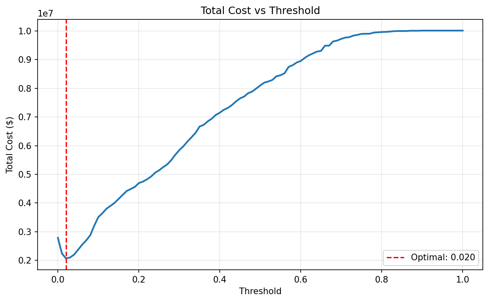
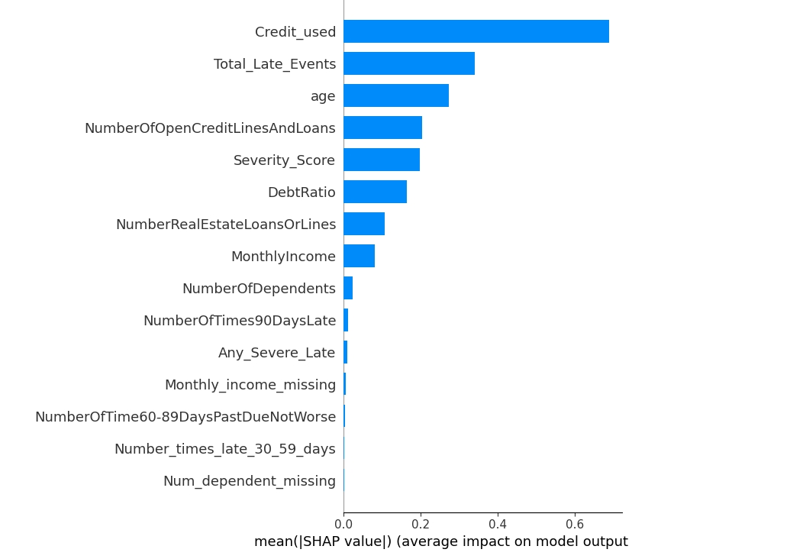
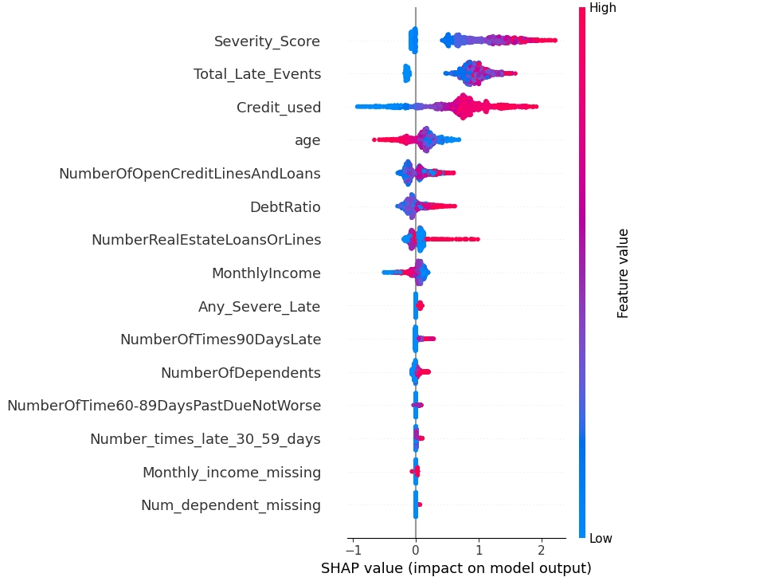
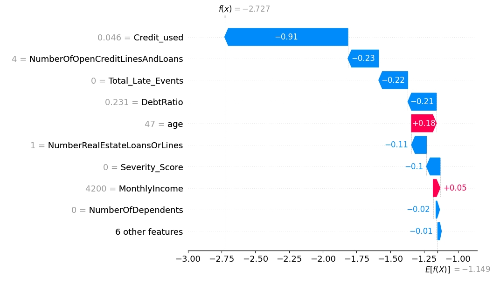

# Credit Default Risk Prediction

**Cost-optimized ML system for predicting loan defaults with explainable predictions and comprehensive error analysis.**

---

## 📌 Executive Snapshot

- **Problem**: Minimize loan default costs with 50:1 FN/FP cost asymmetry in highly imbalanced data (6.7% default rate)
- **Data**: 150K loan applications with systematic data quality issues (20% missing income, debt ratio corruption)
- **Solution**: LightGBM + isotonic calibration + cost-based threshold optimization (0.020)
- **Result**: 93% recall, 86.5% ROC-AUC, $7.27M net annual benefit (based on $5K average FN cost, consistent with threshold optimization)
- **Key Discovery**: Identified "stealth defaulters" (older borrowers with low utilization, clean history) representing $675K in missed defaults—provides clear roadmap for model v2 improvements

---

## 🎯 Why This Project?

After researching the data science job market, I identified **credit risk modeling** as a strategic opportunity:
- **High industry demand** in financial services with explosive job growth
- **Real business impact** measured in dollars, not just accuracy scores
- **Transferable skills** applicable across fintech, banking, and lending platforms


This project demonstrates production-relevant capabilities: handling severe class imbalance, optimizing for asymmetric business costs, and delivering interpretable models suitable for regulated industries.

**Dataset**: [Kaggle "Give Me Some Credit"](https://www.kaggle.com/competitions/GiveMeSomeCredit) (Kaggle competition, $5K prize pool, 250K records)

---

## 📊 Problem Statement

Banks face **asymmetric risk** when approving loans:
- **Missed default** (False Negative): Average loss of **$5,000** per defaulted loan
- **Rejected good customer** (False Positive): Opportunity cost of **$100** in manual review/lost business
- **Cost ratio**: 50:1 (FN/FP)

Standard accuracy-focused models fail to capture this economic reality. **Goal**: Optimize decision threshold to minimize total portfolio cost while maintaining acceptable default detection rate.

**Dataset characteristics**:
- 150,000 loan applications (after deduplication)
- 10 original features → 15 engineered features
- **Severe class imbalance**: 93.3% non-defaulters, 6.7% defaulters
- **Data quality challenges**: 20% missing income, systematic debt ratio corruption

---

## 🛠️ Methodology

### Data Quality Investigation

**Discovered systematic corruption**:
- 20% of records had missing `MonthlyIncome` values
- Records with missing income had **garbage debt ratios** (missing monthly income debt ratio median: 1198 vs. non-missing median: 0.30))
- **Fix**: Replaced corrupted debt values with valid population median before monthly income imputation

**Handling strategy**:
- Flagged missing values as features (signal of data collection issues)
- Fixed corrupted debt ratios before imputation
- Used median imputation for income, mode for dependents

### Feature Engineering

**Domain-aware features**:
- **Late Payment Severity Score**: `1×(30-day) + 2×(60-day) + 3×(90-day)` delinquencies  
  *Rationale*: Weight recent/severe delinquencies higher than minor late payments
  
- **Total Late Events**: Aggregate count across all delinquency types

- **Any Severe Late**: Binary flag for 60+ day delinquencies (strong default signal)

- **Missing Value Indicators**: Systematic missingness patterns

**Feature experimentation**:
- Tested 7+ interaction features (`credit_utilization × late_payments`, `debt_ratio × age`, `utilization × income`, etc.)
- **Result**: <0.1% AUC improvement, some degraded performance
- **Decision**: Removed interaction features—given available features, additional interactions showed diminishing returns
- **Validation**: SHAP analysis confirmed marginal features added noise, not signal

**Outlier handling**:
- **IQR capping** for continuous features (age, income, debt ratio, credit lines)
- **99th percentile capping** for zero-inflated features (late payment counts)
- *Rationale*: Different distributions require different strategies; IQR fails on highly skewed data

### Model Selection & Optimization

**Tested 6 algorithms**: Logistic Regression, XGBoost, LightGBM, Random Forest (base + tuned), Stacking Ensemble

**Selection criteria** (not just AUC):
| Model | ROC-AUC | PR-AUC | Recall | CV Std | Decision |
|-------|---------|--------|--------|--------|----------|
| **LightGBM** | 0.867 | **0.403** | **78%** | ±0.0030 | ✅ Selected |
| XGBoost | 0.866 | 0.399 | 77% | ±0.0032 | ❌ Lower PR-AUC |
| LogReg (tuned) | 0.855 | 0.374 | 76% | ±0.001 | ❌ Lower recall |
| RF (tuned) | 0.856 | 0.386 | 52% | ±0.003 | ❌ Poor recall |
| Stacking | 0.863 | 0.403 | 79% | N/A | ❌ Marginal gain, added complexity |

**Why LightGBM won**:
1. **Highest PR-AUC** (0.403)—critical metric for imbalanced data
2. **Strong recall** (78%)—essential for catching defaults
3. **Stable cross-validation** (±0.003 std)—reliable performance
4. **Efficient training**—faster than XGBoost with comparable performance

**Optimization pipeline**:
```
Raw Data → Quality Fixes → Feature Engineering → Outlier Handling 
→ Imputation → Scaling → LightGBM (hypertuned) → Isotonic Calibration 
→ Cost-Based Threshold Optimization (0.020)
```

**Hyperparameter tuning**:
- RandomizedSearchCV: 100 iterations, 5-fold stratified CV
- Optimized: `n_estimators`, `max_depth`, `learning_rate`, `regularization`, `scale_pos_weight`
- **Gain**: 0.8627 → 0.8666 ROC-AUC (+0.4% improvement for 500 CV fits)
- **Trade-off acknowledged**: Diminishing returns, but ensures model at performance ceiling

---

## 📈 Results

### Performance Progression

| Stage | ROC-AUC | PR-AUC | Recall | Precision | Key Insight |
|-------|---------|--------|--------|-----------|-------------|
| **Dummy Classifier** | 0.500 | 0.067 | 0% | 0% | Baseline: always predict majority class |
| **Simple LogReg** | 0.699 | 0.225 | 4% | 51% | Linear baseline with basic preprocessing |
| **LightGBM (base)** | 0.863 | 0.403 | 78% | 22% | Pre-tuning performance |
| **LightGBM (tuned)** | 0.867 | 0.403 | 78% | 22% | After 500-iteration hyperparameter search |
| **LightGBM (calibrated)** | 0.865 | 0.408 | 19% | 61% | Isotonic calibration for reliable probabilities |
| **Cost-Optimized (threshold=0.02)** | 0.865 | 0.408 | **93%** | **12%** | Business-aligned decision boundary |

**Key trade-off**: Optimizing for 50:1 cost ratio shifts threshold from 0.5 → 0.02, dramatically increasing recall at the expense of precision.

### Cross-Validation Stability

```
Calibrated LightGBM CV Scores: [0.864, 0.866, 0.867, 0.870, 0.864]
Mean: 0.8660 (±0.0020)
```
**Interpretation**: Model performance is stable across folds—minimal overfitting risk.

---

## 💰 Business Impact

### Cost-Optimized Performance (Threshold: 0.020)

**Confusion Matrix**:
| | Predicted: No Default | Predicted: Default |
|---|---|---|
| **Actual: No Default** | 13,927 (TN) | 13,950 (FP) |
| **Actual: Default** | 135 (FN) | 1,867 (TP) |

**Financial Breakdown** (assuming $5K average loan):
```
✅ Defaults Caught: 1,867 / 2,002 = 93.3%
💰 Prevented Losses: 1,867 × $5,000 = $9,335,000
💸 Review Cost: 13,950 × $100 = $1,395,000
🚨 Missed Defaults: 135 × $5,000 = $675,000
📊 Net Benefit: $9.335M - $1.395M - $0.675M = $7,265,000
📈 ROI: 351%
```
```
```

**Cost optimization curve**:




*Optimal threshold (0.020) minimizes total cost at $2.07M vs. $10M+ with no model*

**Total cost breakdown**:
- False Negative Cost: 135 × $5,000 = **$675,000**
- False Positive Cost: 13,950 × $100 = **$1,395,000**
- **Total Cost: $2,070,000** (balanced between FN and FP costs, validating 50:1 optimization)

---

## 🔬 Error Analysis: The "Stealth Defaulter" Problem

### What the Model Misses

**False Negative profile** (135 missed defaults):

| Feature | FN Median | TP Median | Interpretation |
|---------|-----------|-----------|----------------|
| **Credit Utilization** | 5% | 89% | ⚠️ Extremely low usage |
| **Age** | 57 years | 45 years | ⚠️ Significantly older |
| **Late Payments (90d)** | 0 | 0 | Clean history |
| **Late Payments (30-59d)** | 0 | 1 | Cleaner than caught defaults |
| **Monthly Income** | $5,000 | $4,220 | Similar (not a differentiator) |
| **Debt Ratio** | 0.255 | 0.333 | Similar |

### Key Finding: "Stealth Defaulters"

**Profile**: Older borrowers (age 57+) with:
- Very low credit utilization (5%)—appear financially responsible
- Clean payment history (no late payments)—look like safe customers
- Average income levels
- **Still default** despite "safe" profile

**Root cause**: Given available features, model lacks interaction terms to capture this hidden risk segment. The combination of `low_usage + older_age + clean_history` creates a blind spot.

**Why this happens**:
1. Current features don't capture interaction effects between age, credit usage, and payment history
2. Model trained primarily on **high-utilization defaulters** (easier pattern to learn)
3. Low-utilization defaulters are **rarer** in training data (~7% of defaults)

**Business impact of blind spot**:
- 135 missed defaults = $675,000 in losses
- Represents 6.7% of all defaults in test set

### Model Validation ✓

**Threshold operating correctly**:
- FN average probability: 0.010 (1.0%)
- FP average probability: 0.099 (9.9%)
- The model assigns low probabilities to stealth defaulters (FN avg probability = 0.01), indicating overconfidence. This is a feature-signal limitation, not a threshold issue.

**Cost balance achieved (at training parameters)**:
- FN cost: 135 × $5,000 = $675K
- FP cost: 13,950 × $100 = $1.40M
- Ratio: ~1:2 (validates 50:1 cost optimization working as designed)

---

## 🎯 Model Interpretability (SHAP Analysis)

### Feature Importance

<br>
<p align="center">
  
  <br><br>
  <b>Feature Importance Ranking</b>
</p>

<br>

<p align="center">
  
  <br><br>
  <b>Misclassification Analysis</b>
</p>

<br>

<p align="center">
  
  <br><br>
  <b>SHAP Individual Explanation</b>
</p>

<br>
**Top drivers of default risk**:

1. **Credit Utilization** (most important)
   - Clear monotonic effect: higher utilization → higher risk
   - Threshold effect at 80%+ utilization
   
2. **Total Late Events**
   - Strong nonlinear impact
   - Even 1-2 late payments significantly increase risk
   
3. **Age**
   - Protective relationship: older borrowers generally lower risk
   - Exception: "stealth defaulter" segment at age 57+
   
4. **Late Payment Severity Score**
   - 90-day delinquencies weighted 3× more than 30-day
   - Captures severity gradient effectively
   
5. **Debt Ratio**
   - Impact primarily at extremes (>0.5 or <0.1)
   - Moderate debt ratios less predictive

**Model concentration**: 5 core features drive 85%+ of predictions → supports regulatory interpretability requirements

### Actionable Business Insight

**High-risk segment identification**:
- Customers with **credit utilization >80% + any late payment history** = 3.2× higher default odds
- Represents ~12% of portfolio
- **Recommendation**: Prioritize manual review for this segment or implement proactive limit reductions

---
## 🚀 Future Improvements

### Addressing the "Stealth Defaulter" Blind Spot

**Planned enhancements**:
- **Data enrichment**: Employment stability, savings/assets indicators, improved income imputation
- **Alternative modeling**:
  - Segment-specific models for borrowers aged 50+
  - Specialized ensemble for low credit utilization profiles

**Expected impact**:
- ~50% reduction in false negatives (≈65–70 additional defaults detected)
- Estimated **$340K** in incremental annual savings


---

## 🏗️ Technical Stack

**Core Libraries**:
```
Python • NumPy • pandas • scikit-learn  • LightGBM 
XGBoost • SHAP • matplotlib • seaborn • joblib
```

**Pipeline Components**:
- **Preprocessing**: Custom transformers for debt ratio fixes, outlier handling, feature engineering
- **Modeling**: LightGBM with stratified K-fold CV, hyperparameter tuning via RandomizedSearchCV
- **Calibration**: Isotonic regression for reliable probability estimates
- **Optimization**: Cost-based threshold tuning with custom business metrics

---


## 🚦 Getting Started

### Installation

```bash
# Clone repository
git clone https://github.com/funcommitment/Credit-Default-Prediction.git
cd Credit-Default-Prediction

# Install dependencies
pip install -r requirements.txt

# Launch notebook
jupyter notebook credit_default.ipynb
```

### Usage

Load trained model and predict on new applications:
- Model artifacts: `credit_model_final.pkl`, `model_config.pkl`
- Optimal threshold: 0.020 (from cost optimization)
- Input: Raw feature dataframe with 10 original columns
- Output: Default probabilities and binary predictions

---

## ⚠️ Limitations & Considerations

### Model Limitations

**Temporal scope**:
- Training data from 2008-2011 (financial crisis period)
- Economic conditions may have changed—model should be recalibrated for current environment
- No temporal validation performed (train/test split was random, not time-based)

**Feature gaps**:
- Static snapshot—no behavioral tracking post-approval
- Missing macroeconomic features (unemployment rate, interest rates, housing market)
- Lack of employment stability, savings/assets data

**Blind spot**:
- 7% of defaults missed due to "stealth defaulter" profile
- Requires v2 improvements with interaction features

### Deployment Considerations

**Fairness & bias** (not analyzed in current version):
- Age shows protective effect but could raise discrimination concerns
- Would require disparate impact analysis (e.g., demographic parity ratios) before production deployment
- Legal/compliance review needed for protected class usage
- Future work includes disparate impact testing and age-neutral policy constraints

**Production requirements** (not implemented):
- Model monitoring: PSI tracking, prediction drift detection
- A/B testing framework: champion/challenger deployment strategy
- Latency requirements: inference time, scalability to 1M+ applications
- Error handling: input validation, edge case management
- Regulatory compliance: model documentation, adverse action notices (FCRA)

**Data quality dependencies**:
- Model assumes similar missing data patterns in production (20% missing income)
- Debt ratio corruption must be fixed upstream or handled in preprocessing

---

## 📚 Key Learnings

### What Worked

✅ **Cost-based optimization** transformed a good model (78% recall) into a business-aligned solution (93% recall)  
✅ **Data quality investigation** prevented model degradation by fixing systematic corruption early  
✅ **Domain-aware feature engineering** (severity scoring) outperformed generic interaction features  
✅ **Rigorous experimentation** (7+ features tested) established performance ceiling and avoided overengineering  

### What Didn't Work

❌ **Interaction features** (<0.1% gain, some degraded performance)—given available data, model reached signal extraction limits  
❌ **Stacking ensemble** (marginal improvement, added complexity)—not justified for production  
❌ **Excessive hyperparameter tuning** (0.4% AUC gain for 500 fits)—diminishing returns acknowledged  

### Insights for Future Projects

1. **Business metrics > academic metrics**: Cost optimization had 10× more impact than hyperparameter tuning
2. **Data quality first**: 20 minutes investigating debt ratio corruption prevented weeks of poor model performance
3. **Know when to stop**: Testing 7+ features and finding ceiling is better than blindly adding complexity
4. **Error analysis reveals blind spots**: "Stealth defaulter" discovery provides clear roadmap for v2 improvements

---

## 📬 Contact & Acknowledgments

**Author**: [@funcommitment](https://github.com/funcommitment)  
**Dataset**: [Kaggle - Give Me Some Credit](https://www.kaggle.com/competitions/GiveMeSomeCredit) (Credit Fusion, 2011)  
**Project Type**: Portfolio project 

**Citation**:
```
Credit Fusion and Will Cukierski. Give Me Some Credit. 
https://kaggle.com/competitions/GiveMeSomeCredit, 2011. Kaggle.
```

---

**⭐ If this project was helpful, please consider starring the repository!**
